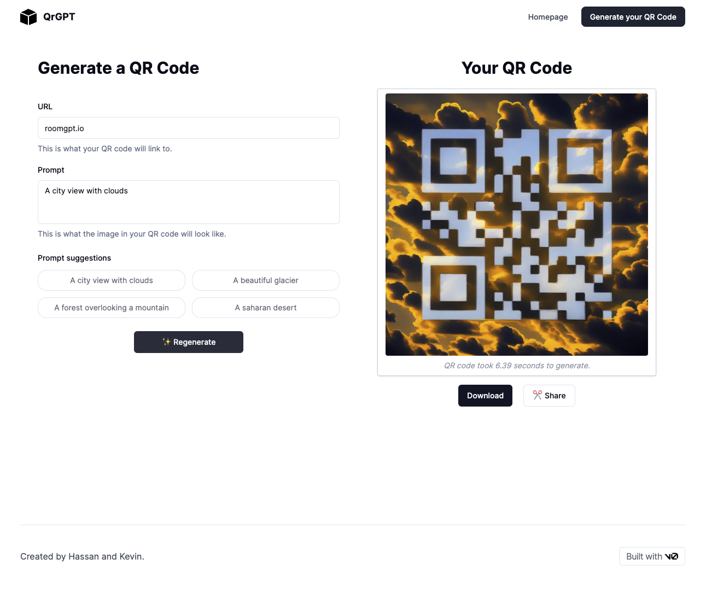

# 每日一签产品需求文档

## 1. 产品概述
### 1.1 产品背景
本产品旨在帮助用户通过输入姓名、性别和生辰时间，计算并展示用户的每日运势。基于八字、喜用神、流年月日等传统算法，提供准确的每日运势分析，包括总运势、爱情、财富、事业四大领域，并提供相关的开运建议。

### 1.2 产品目标
- 提供精准的每日运势计算结果。
- 提供优雅、简洁的页面交互体验，使用户能够轻松获取运势信息。
- 帮助用户了解每日运势并提供针对性的开运建议。

## 2. 产品功能
### 2.1 用户输入模块
- 功能描述：用户在页面头部输入姓名、性别和生辰时间。
- 输入项：
  - 姓名：文本框，支持汉字、英文。
  - 性别：单选按钮，选项为“男”/“女”。
  - 生辰时间：时间选择器，包括年、月、日、时四项。
### 2.2 运势计算模块
- 功能描述：基于用户输入的信息，通过八字、喜用神、流年月日等规则，计算并生成用户每日运势。
- 计算维度：
  - 总运势
  - 爱情运势
  - 财富运势
  - 事业运势
- 算法说明：参考传统命理规则，结合用户的八字信息和当前流年流月的变化，进行详细的运势计算。
### 2.3 运势展示模块
- 功能描述：在页面下半部分展示用户的今日运势数据，并提供个性化的开运建议。
- 展示内容：
  - 今日总运势：显示一个概述性评分（1-5星）和简要描述。
  - 爱情运势：评分和文字描述，结合建议。
  - 财富运势：评分和文字描述，结合建议。
  - 事业运势：评分和文字描述，结合建议。
  - 开运建议：根据计算结果生成开运建议，如适合的颜色、出行时间等。

## 3. 产品架构

### 3.1 页面结构与交互设计
#### 3.1.1 页面结构
- 页面头部：用户输入区域，包含姓名、性别和生辰时间输入项。
- 页面下半部分：运势展示区域，包括各项运势评分和描述，以及开运建议。

#### 3.1.2 交互设计
- 输入验证：当用户输入姓名、性别或生辰时间时，页面会实时进行数据验证。所有必填项未填时，提示“请输入完整信息”。
- 计算按钮：用户输入信息后，点击“计算”按钮触发运势计算。计算完成后页面会自动滑动至结果展示区域。
- 动态更新：运势结果展示区域根据不同日期或用户信息变化而自动更新。
#### 3.1.3 用户体验优化
- 优雅的动画过渡：输入完成后页面展示运势结果时，采用渐入效果，提升用户体验。
- 响应式布局：页面兼容不同设备，确保在移动端和PC端均有良好的展示效果。
#### 3.1.4 颜色
- 主色调：采用黑白配色，后期再调整
- 图标：在运势展示区加入小图标，比如爱心图标用于爱情运势，金币图标用于财富运势等，以提升视觉效果和易读性。

- 登录信息，如果在微信场景传播，可以采用微信登录。前期可以不需要
### 3.2 后端
后端负责接收前端请求，进行运势计算，并返回结果。这里会是难点，也是项目的精华所在，如何将八字、喜用神、流年月日等信息结合起来，形成一个完整的运势计算结果。

#### 1. 用户输入性别和生辰，计算用户的生辰八字

**输入内容**：性别、出生日期和时间。

**实现方式**：调用八字计算接口，根据用户输入的出生日期、时间和性别，计算出用户的八字（天干和地支）。

**技术方案**：可以使用现有的开源库来计算四柱八字，如"Lunar Calendar"相关的算法，或者使用爬虫抓取特定的网站计算八字。

#### 2. 基于用户生辰的八字，计算对应的五行

**实现方式**：需要设计一个【天干地支藏干-五行对应表】来实现天干、地支及其对应的藏干与五行之间的映射关系。每个天干和地支都对应不同的五行元素（金、木、水、火、土），这可以通过查询表来获取。

#### 3. 基于五行的关系计算出日主的身强弱
**实现方式**：需要设计一个【五行关系表】，其中五行之间的生克关系明确。根据五行关系，将八字中的各个天干、地支的五行映射，计算出对用户日主的影响。
- 帮扶日主的五行表：日主的五行和生日主的五行。比如日主为土，帮扶日主的五行是火和土
- 抑制日主的五行表：非生日主的五行以及日主的五行。比如日主为土，抑制日主的五行是金、水和木。

**计算逻辑**：帮扶日主的五行视为生助，增加相应的分值。抑制日主的五行视为克制，不增加分值。不同干支对日主的帮扶程度是不同的，所以分值也不同，年干为8分，月干为12分，日元0分，时干为12分，年支为4分，月令为40分，日支为12分，时支为12分。

- 分值计算规则：根据各五行对日主的影响程度，累加各个天干、地支的分值，最终得出日主的强弱。

- 判断标准：根据得到的分值，对用户的五行进行分类，判断身强或身弱。

- 分值档位：

  - 分值>60，判定为身强。
  - 分值40-60（包含40和60），判定为均衡
  - 分值<40，判定为身弱。
  

#### 4. 计算当天的年月日对应的八字

**实现方式**：调用八字计算接口，基于当天的年月日，计算对应的天干地支八字。

#### 5. 基于地支计算出对应的藏干

**实现方式**：需要设计一个【地支-藏干表】，来计算每个地支对应的藏干。

#### 6. 基于天干和藏干计算对应的五行

**实现方式**：通过【天干地支藏干-五行对应表】将天干和藏干映射为对应的五行属性。通过【天干地支藏干-五行对应表】将天干和藏干映射为对应的五行属性。这些属性将在后续的运势计算中起到重要作用。

#### 7. 基于当日五行关系计算当日运势的分值

**实现方式**：基于项目中已有的【五行关系表】，结合之前用户的身强/身弱/均衡的判定，计算流年、流月、流日的天干和藏干的五行对用户日主的影响。
**计算逻辑**：
- 身强/身弱判断：根据用户之前的身强/身弱/均衡的判定，选择合适的流年月日计算方法。
  - 对于身强者，流年月日遇到克制为吉，不考虑生助。比如日主为土，且日主身强，遇到金、水和木为吉，不管遇到火和土的情况。
  - 对于身弱者，流年月日遇到生助为吉，不考虑克制。比如日主为土，且日主身弱，遇到火和土为吉，不管遇到金、水和木的情况。
  - 对于均衡者，流年月日遇到生助为吉，遇到克制为凶。比如日主为土，且日主均衡，遇到火和土为吉，遇到金、水和木为凶。
- 为吉则加分，为凶则减分，不考虑的情况不加分也不减分。不同的天干和藏干对日主的帮扶程度是不同的，所以分值也不同，流年天干、流月天干、流日天干都为12分，流年月日对应的藏干中分为三档，第一档为12分，第二档为7.2分，第三档为3.6分。
 
**输出结果**：
- 当日的运势分值将以百分制形式呈现，辅助用户理解自己当天的整体运势状态。

### 3.3 数据库表设计
#### 3.3.1 用户信息表（Users）
- `user_id` (INT, PRIMARY KEY, AUTO_INCREMENT) - 用户唯一标识
- `name` (VARCHAR(50)) - 用户姓名
- `gender` (VARCHAR(10)) - 用户性别（“男”或“女”）
- `birth_datetime` (DATETIME) - 用户生辰时间
- `created_at` (TIMESTAMP) - 记录创建时间
- `updated_at` (TIMESTAMP) - 记录更新时间

#### 3.3.2 运势计算记录表（DailyFortune）  
- `record_id` (INT, PRIMARY KEY, AUTO_INCREMENT) - 记录唯一标识
- `user_id` (INT, FOREIGN KEY) - 对应用户ID
- `fortune_date` (DATE) - 计算运势的日期
- `overall_score` (INT) - 总运势评分（1-5）
- `love_score` (INT) - 爱情运势评分（1-5）
- `wealth_score` (INT) - 财富运势评分（1-5）
- `career_score` (INT) - 事业运势评分（1-5）
- `fortune_description` (TEXT) - 运势描述
- `opening_advice` (TEXT) - 开运建议
- `created_at` (TIMESTAMP) - 记录生成时间

## 4. 技术选型
- [Next.js](https://nextjs.org/) & [Tailwind](https://tailwindcss.com/) for frontend
- [Vercel postgreSQL](https://vercel.com/docs/concepts/databases/postgres) for database
- [Lunar](https://github.com/lunar-js/lunar) for Bazi calculation
- [Dify](https://www.dify.ai/) for LLM
- XXX for luck calculation

## 5. 开发流程

### 5.1 第一阶段：基础功能完善（必须完成）
**1. 开发环境和生产环境区分**
- 创建 .env.development 和 .env.production
- 配置不同环境的 API 地址、数据库连接等
- 设置环境变量

**2. 数据库操作**
- 设计数据库架构（用户表、八字记录表等）
- 使用 Prisma 或其他 ORM 工具
- 实现基本的 CRUD 操作

**3. 错误处理**
- 实现全局错误处理
- 添加错误页面（404、500等）
- 添加错误日志记录

**4. 页面适配性**
- 移动端适配
响应式设计优化
- 加载状态优化

### 5.2 第二阶段：用户系统（重要）
**1. 登录注册系统**
- 基本邮箱/手机号注册
- 密码重置流程
- Session 管理
- 微信登录集成

**2. 网站备案**
- 阿里云 ICP 备案
- 添加备案信息到页面底部
- 配置相关安全设置

### 5.3 第三阶段：质量保证（重要）
**1. 测试体系**
   ```
   
   // 示例：八字计算的单元测试
   describe('BaziService', () => {
     test('calculateBazi should return correct values', () => {
       const birthDate = new Date('2024-01-01');
       const result = BaziService.calculateBazi(birthDate);
       expect(result).toMatchSnapshot();
     });
   });
   ```
**2. 性能优化**
- 网速检测实现
- 页面加载优化
-   资源压缩

### 5.4 第四阶段：商业化（可后续实现）
**1. 数据分析**
集成数据埋点（如 Google Analytics）
- 用户行为跟踪
- 转化率分析

**2. 支付系统**
- 接入支付宝/微信支付
- 海外支付方案（如 Stripe）
- 订单管理系统**
