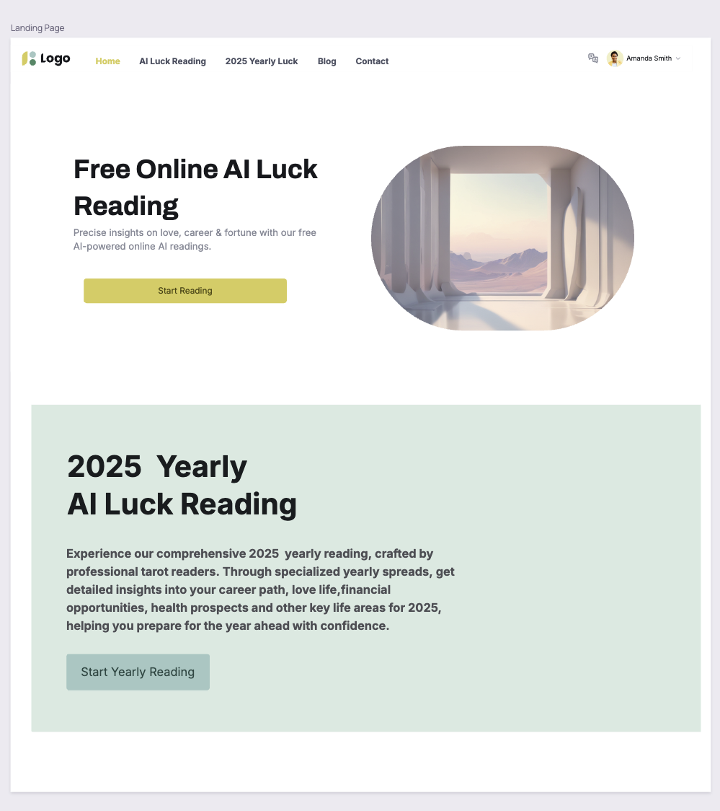

# 好运盒子项目需求文档

## 产品目标

1. 产品名称
- 好运盒子，luckybox--好运要及时打开
- 域名：luckybox.ai，myluck.today

2. 一句话描述
- 2024 AI luck : Precise insights on love, career & fortune. 
  - Open lucky box every day, choose your AI reader for personalized online lucky box 
- Free AI online luck reading

## 产品实现功能

- 免费每日运势占卜，日常功能，可以定格在首页
- 免费占卜，进入之后可以选择不同法师或者方法占卜
    - 优先实现这个功能。
    - 优先按照tarotap的思路，把tarot换成八字和紫薇试一下gpt4o的效果。
    - 接入不同风格的AI帮助用户用八字解读今日运势、新年运势、爱情、感情等运势。一定是把所有的话通过AI的方式和用户讲出来。当用户希望继续追问的时候，可以向用户收费
- 新年运势解读，收费

## 产品交互流程
### 产品主要功能插件
- 登录 clerk
- 多语言 next-intl。这个往后放一下。
- 主题颜色 
- datbase prisma、neon
- pay stripe

### 免费占卜交互流程设计

1. **首页**
   - 展示产品名称和口号：如“好运盒子 - 好运要及时打开”
   - 产品的亮点以及好的用户反馈呈现
   - 按钮：点击“开始免费占卜”

2. **选择占卜师**
   - 展示占卜师列表：每位占卜师的头像、名字和简介,每位占卜师旁边有“开始占卜”按钮
   - 用户选择：用户点击选择某位占卜师

3. **输入个人信息**
   - 表单：用户输入出生日期、时间、性别和地点（如果需要）
   - 按钮：点击“提交信息”

5. **占卜过程以及解读**
   - 展示占卜动画：如卡片翻转或星星闪烁等
   - AI解读：占卜师通过AI进行解读，展示结果
   - 结果展示：用户可以看到占卜结果的详细信息
   - 提示：如果用户有更多问题，可以“追问”

###研发思路

1. 通过V0生成landingpage，完成header、footer。配置tailwindcss
2. 接入clerk，完成登录注册
3. 完成chooseAIReader页面，完成占卜师列表的展示
4. 完成information-input页面，完成用户信息的输入

prisma, 估计要重新设计了